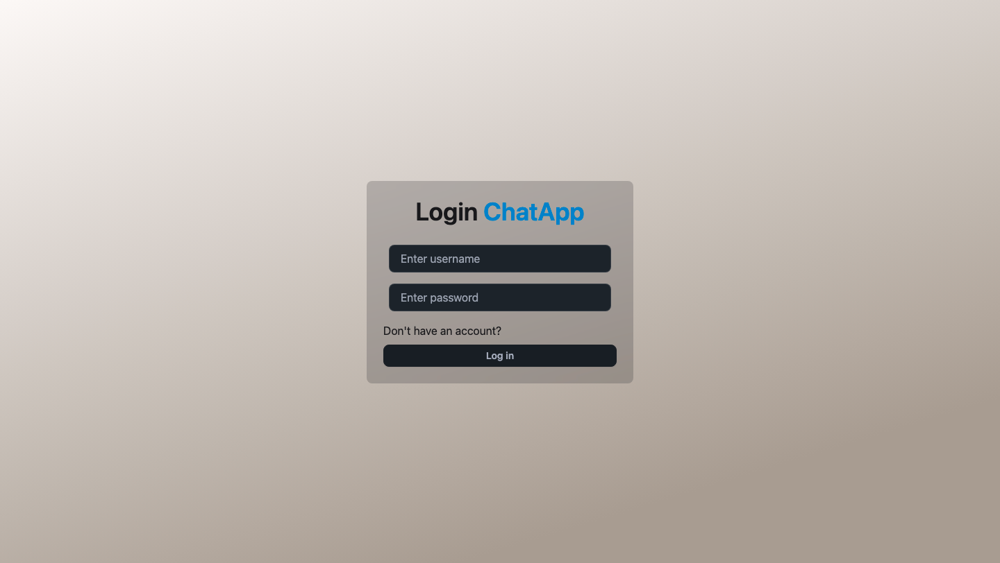
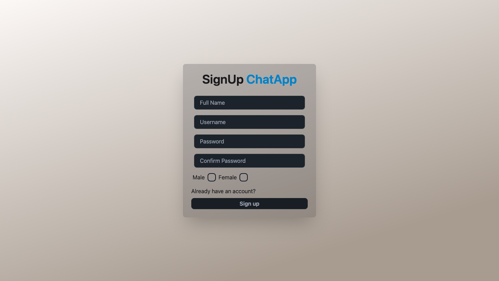
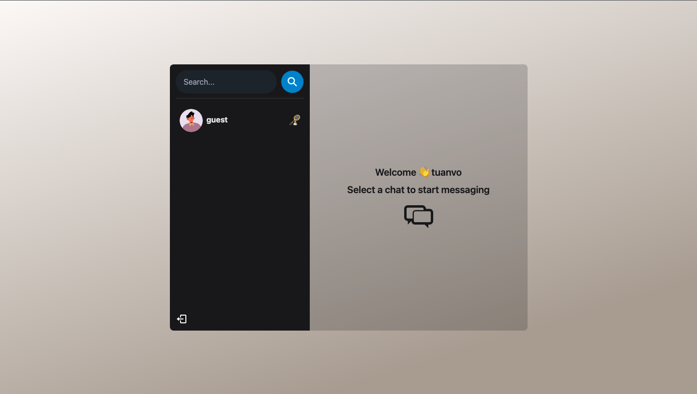

# ChatApp

## Introduction

Welcome to ChatApp documentation ChatApp is a web-based application using MERN
stack designed to facilitate real-time communication between users. It provides 
a platform where users can join chat rooms, exchange messages, and engage in 
conversations with other users.

To try the web, please click the link [below](#base-url). There might be the
delay issue due to the deployment platform.

---

## Table of Content

- [Getting Started](#getting-started)
  - [Base URL](#base-url)
  - [Demo](#demo)
  - [Technologies](#technologies)
- [Set up env file](#set-up-env-file)
- [Build the WebApp](#build-the-web-app)
- [Start the WebApp](#start-the-web-app)
- [Deploy the WebApp](#deploy-the-app)


# Getting Started
## Base URL
[https://chatapp-rsld.onrender.com/](https://chatapp-rsld.onrender.com/)
## Demo
**Login Page**



**Signup Page**



**Home Page**


## Accounts
1. **account:** tuanvo  **password:** 123456
2. **account:** guest   **password:** 123456


## Technologies
1. **bcryptjs** -> hashing password before storing to database
2. **cookie-parser** -> parse cookies attached to the clients' request
3. **cors** -> allows controlled access to resources located on a different domain
4. **dotenv** -> load environment variables from a .env file
5. **express** -> web application framework for Node.js.
6. **jsonwebtoken** -> generate and verify JSON Web Tokens (JWTs).
7. **mongoose** -> Object Data Modeling (ODM) library
8. **socket\.io** -> real-time, bidirectional communication between web clients and servers.
9. **socket\.io-client** 

**To install:**
```js
npm install bcryptjs cookie-parser cors dotenv express jsonwebtoken mongoose socket.io socket.io-client
```

# Set up ENV file
```js
PORT=...
MONGO_DB_URI=...
JWT_SECRET=...
NODE_ENV=...
```
# Build the Web App
```
npm run build
```
# Start the Web App
```
npm start
```


